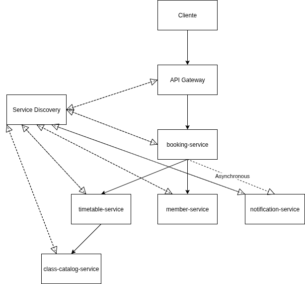

# gym-booking-microservices
Proyecto de portfolio de una aplicación de reserva de clases de gimnasio con arquitectura de microservicios en Java y Spring Boot.

## Arquitectura
El sistema está compuesto por varios microservicios, cada uno con una responsabilidad única. La comunicación se gestiona a través de un API Gateway y un Service Discovery para un sistema desacoplado y escalable.



### Microservicios
* **class-catalog-service (Puerto 8082):** Gestiona los tipos de clases y sus descripciones.
* **member-service (Puerto 8081):** Gestiona el registro y los perfiles de los socios.
* **timetable-service (Puerto 8083):** Gestionará el horario y el aforo de las clases.
* **booking-service (Próximamente):** Orquestará el proceso de reserva.
* **api-gateway (Puerto 8080):** Punto de entrada único al sistema.
* **discovery-service (Puerto 8761):** Registro y descubrimiento de servicios (Eureka).

## Tecnologías Utilizadas
* **Lenguaje:** Java 17
* **Framework:** Spring Boot 3
* **Base de Datos:** H2 (en memoria para desarrollo)
* **Gestión de Proyecto:** Maven
* **API:** RESTful con Spring Web
* **Documentación API:** SpringDoc OpenAPI (Swagger)
* **Herramientas:** Lombok

## Cómo Empezar

Para ejecutar este proyecto, necesitarás tener instalado Java 17 y Maven.

1.  **Clonar el repositorio:**
    ```bash
    git clone [https://github.com/TU_USUARIO/gym-booking-microservices.git](https://github.com/TU_USUARIO/gym-booking-microservices.git)
    cd gym-booking-microservices
    ```

2.  **Construir el proyecto padre:**
    Este paso es crucial para que los módulos hijos puedan encontrar sus dependencias.
    ```bash
    cd gym-booking-parent
    mvn clean install
    ```

3.  **Ejecutar los microservicios:**
    Abre un terminal para cada microservicio que quieras ejecutar y arráncalo con el siguiente comando:
    ```bash
    # Desde la carpeta de cada servicio (ej: class-catalog-service)
    mvn spring-boot:run
    ```

    El orden para el correcto funcionamiento sería el siguiente: 
    1º Levantamos el discovery-service.
    2º API-gateway.
    3º Es indiferente el orden a partir de aquí.

    PD. Hay que tenr en cuenta que para probar cualquier endpoint habría que crear primero los datos mediante POST, ya que no hay una base de datos creada ni se crean de momento datos de prueba.

5.  **Acceder a la API:**
    Para acceder a cualquier microservicio lo hace a través del API-gateway: http://localhost:8080/api/v1/
    En el OpenAPI de cada microservicio se puede comprobar la url exacta para probar endpoints en postman.

## Estado del Proyecto (29/10/2025)
Todos los microservicios en funcionamiento
Última tarea realizada: Tras haber manejado los huecos disponibles en una clase en la anterior tarea, en esta nos hemos centrado en qué hacer cuando está llena. Hemos creado la Entity Waiting-List, actualizado la lógica de reserva para que te añada si la clase está llena y lo hemos dejado preparado para que te avise si alguien cancela. (Futura implementación con RabbitMQ)
